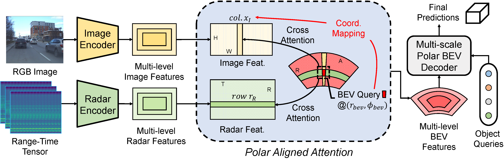

# [NIPS2023] Echoes Beyond Points: Unleashing the Power of Raw Radar Data in Multi-modality Fusion

This is the official implementation of [EchoFusion](https://arxiv.org/abs/2307.16532).

## Abstract
In this work, the authors present a novel method named EchoFusion
to skip the existing radar signal processing pipeline and then incorporate the radar raw data with other sensors. Specifically, the EchoFusion first generate the Bird’s Eye View (BEV) queries and then take corresponding spectrum features from radar to fuse with other sensors. By this approach, the EchoFusion could utilize both rich
and lossless distance and speed clues from radar echoes and rich semantic clues from images, making the method surpass all existing methods on the RADIal dataset, and approach the performance of LiDAR.

## Methods


## Getting Started
- [Installation](docs/install.md)
- [Prepare Dataset](docs/prepare_dataset.md)
- [Run and Eval](docs/getting_started.md)

## Reannotated BBox Label for RADIal
The reannotated bbox-level label is provided in the file radial_bbox_labels.csv. Each label contains the following information:
- numSample: number of the current synchronized sample between all the sensors. That is to say, this label can be projected in each individual sensor with a common dataset_index value. Note that there might be more than one line with the same numSample, one line per label;
- [radar_X_m, radar_Y_m, radar_Z_m]: Object geometric center of each label under radar coordinate system, with x-axis pointing to the front, y-axis pointing to the left, and z-axis pointing to the upright.
- [dim_X_m, dim_Y_m, dim_Z_m]: Object size along each dimension.
- rotation_y: Angle on the x-y plane. 0 deg is the positive x-axis.
- class: 1 means vehicle, while -1 means no valid objects.

## Citation
Please consider citing our work as follows if it is helpful.

```
@inproceedings{liu2023echoes,
  title={{Echoes Beyond Points: Unleashing the Power of Raw Radar Data in Multi-modality Fusion}},
  author={Liu, Yang and Wang, Feng and Wang, Naiyan and Zhang, Zhaoxiang},
  booktitle={NeurIPS},
  year={2023}
}
```

## Acknowledgments
This project is based on the following codebases.  

* [MMDetection3D](https://github.com/open-mmlab/mmdetection3d)
* [PolarFormer](https://github.com/fudan-zvg/PolarFormer)
* [RADIal](https://github.com/valeoai/RADIal/tree/main)
* [KRadar](https://github.com/kaist-avelab/K-Radar/tree/main)
